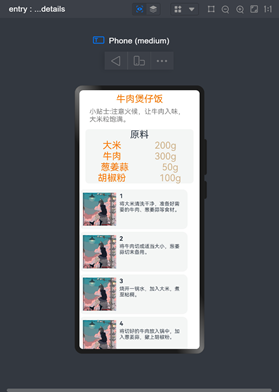

## OVERVIEW

这个只是一个在不到两天时间内做完的学校选修课大作业，有很多不足，首先后端的服务器仅仅起到了用户管理和API数据整理的作用，虽然有点脱裤子放屁，但是这样做之后还是让前端的数据处理轻松了不少。

后期那个关键字搜索和收藏夹看起来那么简陋是有原因的，因为这是考试周，我实在做不动了，鸿蒙里面出现了大量的屎山代码，我也懒得去优化前端界面了，能用就行（）

**综上，这只是一个类似于大作业的项目，能做到拿来就能用 但是也有很大的拓展空间**

时间、技术都有限，希望能有点参考价值，谢谢。

# # 注意事项

使用flask作为后端框架，注意配置好自己的数据库，在secure.py中修改

## API

项目使用的api来自https://www.mxnzp.com/doc/detail?id=37

配置需要在app/spider 里配置好↓：

```python
app_id = ""#自己的api
app_secret = ""#自己的api
```

主界面


登录界面


菜谱界面


详情界面



收藏界面


 

项目说明

# 项目需求分析

1. 用户有注册自己账号的功能，以用户名称为唯一标识。
2. 用户有登录自己账号的功能。
3. 用户可以根据分类来寻找菜谱。
4. 用户可以搜索自己想要的菜谱。
5. 用户可以查询菜谱的详细教程和信息。
6. 用户可以将自己喜欢的菜谱收藏。
7. 用户可以查看自己收藏的菜谱，并可以查看收藏菜谱的详细教程和信息。

# 项目总体架构

## 外部API

项目采用免费API：https://www.mxnzp.com/api/cookbook/search

经过利用postman进行请求后发现原始API返回的信息较为冗杂，不利于前端进行直接加工处理，有的地方甚至出现四层嵌套，因此考虑自己手写一个后端服务器进行通信。

## 后端服务器

使用python-flask框架搭建服务器，设立查询菜谱id、查询分类、登录、注册、添加收藏、查看等接口，同时利用SQLAlchemy实现了与MYSQL数据库的沟通，在MYSQL中创建了User表，用来存储用户的用户名，对用户的密码生成hash摘要进行加密，确保安全性。

对于api接口，编写viewFunction进行路由规划，编写recipe类进行业务模型封装，对api返回的原始数据进行裁剪。

对于用户收藏，建立favoriteDishes表管理username和菜品id，利用查找功能完成用户收藏功能。


服务器表数据展示


整体通信采用json通信，只有在添加收藏和注册时采用POST请求，其余方法均为GET请求。

## 前端Harmony开发

## 用户登录与注册环节

用户进入后主页后，首先选择进行注册或者登录，在注册时，当点击确定按钮，向后端服务器提交表单，后端要保证用户名在数据库中唯一，如果用户名重复，抛出错误异常给前端，前端利用showToast告知用户，如果用户名不重复，则将该用户名和加密后的密码存入数据库，并将界面推入至主界面，在推入的过程中将username作为参数推给下一个页面

用户选择登录时，输入用户名和密码，向后端提交表单，然后后端首先校验用户名是否存在于数据库，如果不存在，抛出异常至前端显示“用户名不存在”，然后再校验密码，如果密码错误，抛出异常至前端显示“密码错误”，如果密码正确，用户登录成功，进入至主界面。（其实这里可以让后端发个cookie，然后前端校验cookie就可以了，但是这样项目复杂度已经太大了qaq，就没做）

## 主界面

主界面由一个tabBar和tabContent构成，其中让用户选择是查看食谱还是查看自己收藏的食谱，如果选择查看食谱，则上侧出现一个tabBar，让用户选择分类。

这里出现了一个程序问题，就是当我写完整个代码的时候我发现tabContent是在整个page被加载的时候同时初始化，这样我就没有办法把tabContent封装成一个单独的组件进行构成（因此复制了好多行，这个算是一个项目的小遗憾），我对食谱的摘要信息构建了一个Article类，然后构建了一个由这个类组成的数组，向后端发送请求获得信息之后，这个数组就填充好了，然后利用forEach进行循环渲染展示界面，其中每一个摘要都可以进行点击，点击之后推入详情界面，将食谱的id传入新界面，同时新界面在初始化时会向后端服务器发送请求，获取食谱详细信息，最然后进行渲染。

## 用户搜索

用户搜索，这个发现现成的接口虽然有按照关键字搜索，但是依然需要进行两层处理，于是我修改了搜索逻辑直接搜索菜品id，然后推入详情页面进行展示。

## 用户收藏

用户收藏是在食谱详细信息界面开始的，当用户进入某一个食谱的详细信息界面时，点击收藏按钮，向后端发送添加收藏的请求，后端服务器首先在favoriteDishes数据库中查询该用户是否收藏了这个菜，如果是，抛出异常到前端告知用户“已经收藏过了”，否则，添加到数据库中，收藏阶段完成

用户查看收藏时，向服务器发送请求，服务器返回该用户名下所有收藏的菜品id，然后利用forEach循环渲染进行展示，这个组件和主界面中的菜谱摘要组件一样，也可以查询详细信息。